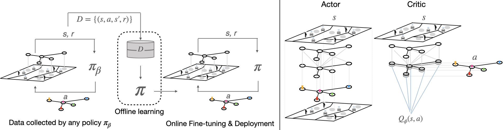

# Offline-RL for AMOD
Official implementation of [Learning to Control Autonomous Fleets from Observation via Offline Reinforcement Learning](https://arxiv.org/abs/2302.14833)

</td> <br/>

## Prerequisites

You will need to have a working IBM CPLEX installation. If you are a student or academic, IBM is releasing CPLEX Optimization Studio for free. You can find more info [here](https://community.ibm.com/community/user/datascience/blogs/xavier-nodet1/2020/07/09/cplex-free-for-students)

To install all required dependencies, run
```
pip install -r requirements.txt
```

## Contents

* `src/algos/sac.py`: PyTorch implementation of Graph Neural Networks for SAC.
* `src/algos/cql.py`: PyTorch implementation of Graph Neural Networks for CQL.
* `src/algos/heuristic.py`: greedy rebalancing heuristic.
* `src/algos/reb_flow_solver.py`: thin wrapper around CPLEX formulation of the Minimum Rebalancing Cost problem.
* `src/envs/amod_env.py`: AMoD simulator.
* `src/cplex_mod/`: CPLEX formulation of Rebalancing and Matching problems.
* `src/misc/`: helper functions.
* `src/conf/`: config files to load hyperparamter settings.
* `data/`: json files for the simulator of the cities.
* `saved_files/`: directory for saving results, logging, etc.
* `ckpt/`: model checkpoints.
* `replaymemories/`: data for offline RL.

## Examples

To train an agent online, `main_SAC.py` accepts the following arguments:
```
cplex arguments:
    --cplexpath     defines directory of the CPLEX installation
    
model arguments:
    --test            activates agent evaluation mode (default: False)
    --max_episodes    number of training episodes (default: 10000)
    --max_steps       number of steps per episode (default: T=20)
    --hidden_size     node embedding dimension (default: 256)
    --no-cuda         disables CUDA training (default: True, i.e. run on CPU)
    --directory       defines directory where to log files (default: saved_files)
    --batch_size      defines the batch size 
    --alpha           entropy coefficient 
    --checkpoint_path path where to log model checkpoints
    --city            which city to train on 
    --rew_scale       reward scaling 
    --critic_version  defined critic version to use (default: 4)

simulator arguments: (unless necessary, we recommend using the provided ones)
    --seed          random seed (default: 10)
    --json_tsetp    (default: 3)
```

To train an agent offline, `main_CQL.py` accepts the following arguments (additional to main_SAC):
```
    
model arguments:
    --test            activates agent evaluation mode (default: False)
    --memory_path     path, where the data is saved
    --cuda            enables CUDA training (default: True)
    --min_q_weight    conservative coefficient (eta in paper)
    --samples_buffer  number of samples to take from the dataset 
    --lagrange_tresh  lagrange treshhold tau for autonamtic tuning of eta 
    --st              whether to standardize data (default: False)
    --sc              whether to scale the data (default: Fasle)     
```

**Important**: Take care of specifying the correct path for your local CPLEX installation. Typical default paths based on different operating systems could be the following
```bash
Windows: "C:/Program Files/ibm/ILOG/CPLEX_Studio128/opl/bin/x64_win64/"
OSX: "/Applications/CPLEX_Studio128/opl/bin/x86-64_osx/"
Linux: "/opt/ibm/ILOG/CPLEX_Studio128/opl/bin/x86-64_linux/"
```
### Training and simulating an agent online

1. To train an agent online:
```
python main_SAC.py --city {city_name}
```

2. To evaluate a pretrained agent (for cities nyc_brooklyn, shenzhen_downtown_west, san_francisco) run the following:
```
python main_SAC.py --city {city_name} --test True --checkpoint_path SAC_{city_name}
```
### Training and simulating an agent offline

1. To train an agent offline (we provide the current hyperparameters in a yaml file):
```
python main_CQL.py --city city_name --load_yaml True
```

2. To evaluate a pretrained agent run the following:
```
python main_CQL.py --city {city_name} --test True --checkpoint_path CQl_{city_name}
```
## Credits
This work was conducted as a joint effort with [Daniele Gammelli*](https://scholar.google.com/citations?user=C9ZbB3cAAAAJ&hl=de&oi=sra), [Filipe Rodrigues'](http://fprodrigues.com/), [Francisco C. Pereira'](http://camara.scripts.mit.edu/home/), at Technical University of Denmark' and Stanford University*. 

----------
In case of any questions, bugs, suggestions or improvements, please feel free to contact me at csasc@dtu.dk.
